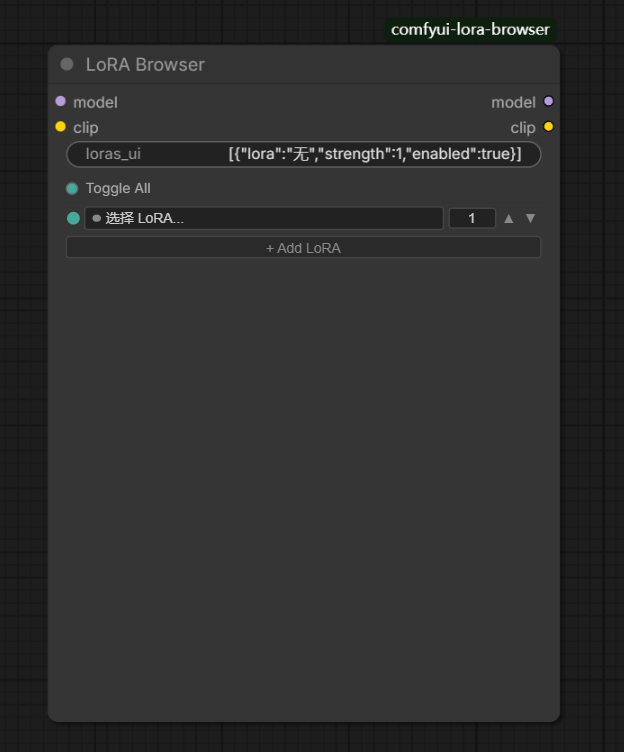
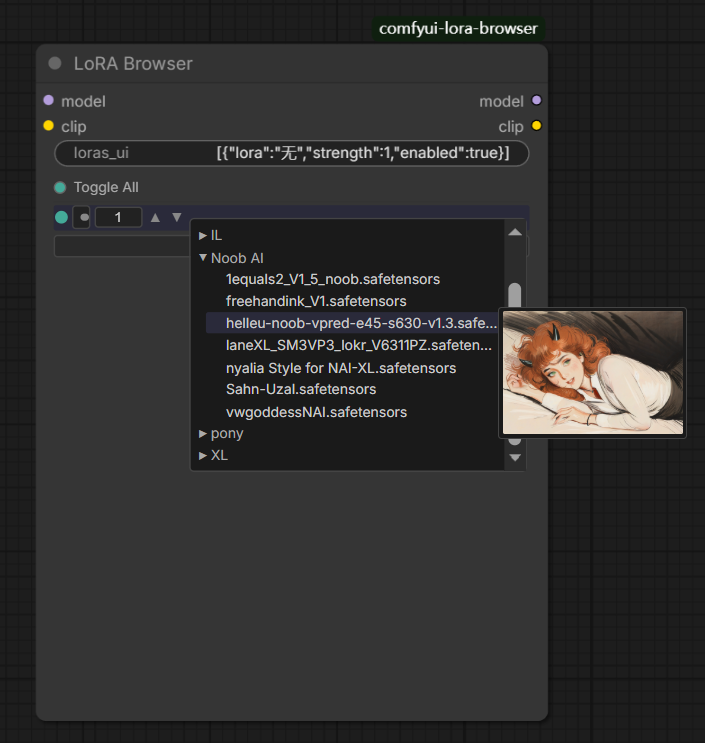
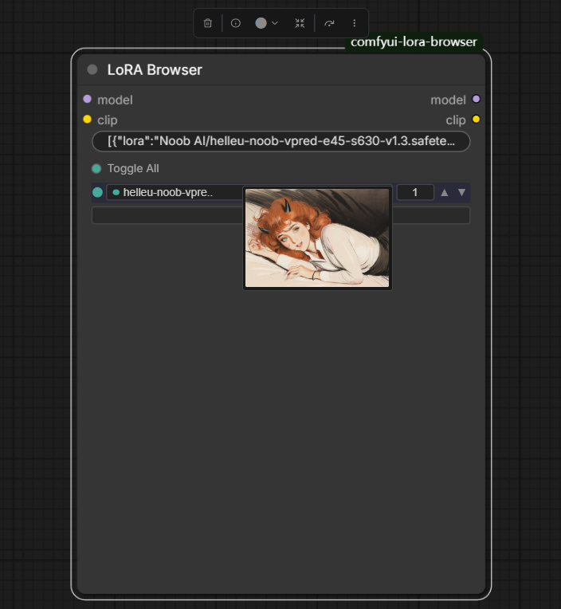
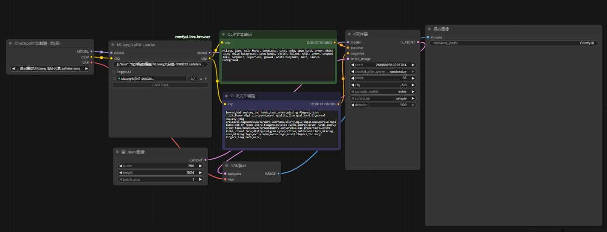

# MLiang LoRA Loader

**English** | [中文](#中文文档)

A professional ComfyUI custom node for browsing and loading LoRA files with folder-tree navigation, multi-slot support, and instant preview.

---

## 📸 Screenshots

| Node UI | Tree Browser | Preview | Workflow |
|---------|-------------|---------|----------|
|  |  |  |  |

---

## ✨ Features

- **🗂️ Folder-tree Browsing** — Navigate your LoRA collection by real folder hierarchy
- **🔍 Real-time Search** — Type to instantly filter, auto-expand matching branches
- **⌨️ Keyboard Navigation** — `↑↓` to move highlight, `Enter` to select, `Escape` to close
- **🔗 Multi-slot Loading** — Add unlimited LoRA slots, applied sequentially
- **🎛️ Strength Control** — Text input with `▲▼` arrow fine-tuning per slot
- **🖼️ Hover Preview** — Mouse over any LoRA file to see preview image instantly
- **📋 Right-click Menu** — Show Info / Toggle / Move Up/Down / Remove
- **🔄 Toggle All** — One-click enable/disable all LoRAs

---

## 🚀 Quick Start

### Installation

**Method A — ComfyUI Manager** (recommended)
> Search `MLiang LoRA Loader` in ComfyUI Manager → Install → Restart ComfyUI

**Method B — Git Clone**
```bash
cd ComfyUI/custom_nodes/
git clone https://github.com/dingmuliang/comfyui-mliang-lora-loader.git
```
Then restart ComfyUI.

### Usage

1. Search **"MLiang LoRA Loader"** in the node list
2. Connect MODEL and CLIP inputs
3. Click the **file button** to open the tree panel
4. Expand folders → click to select a LoRA file
5. Adjust Strength (type or use `▲▼` arrows)
6. Click **"+ Add LoRA"** to add more slots
7. Right-click any LoRA row for context menu

---

## 📁 Project Structure

```
comfyui-mliang-lora-loader/
├── __init__.py              # Python backend
├── js/
│   ├── lora_browser.js      # Frontend DOM widget
│   └── tree_data.js         # Auto-generated folder tree
├── assets/                  # Screenshots
├── .github/workflows/       # CI/CD
├── README.md
├── LICENSE
├── pyproject.toml
└── requirements.txt
```

---

## ⚠️ Known Limitations

- New LoRAs require ComfyUI restart
- Preview images need same-name PNG/JPG files
- Single strength value for model+clip (planned for future)

---

## 🙏 Credits

Inspired by and references:

- [rgthree-comfy](https://github.com/rgthree/rgthree-comfy) — UI design inspiration
- [ComfyUI-Lora-Manager](https://github.com/willmiao/ComfyUI-Lora-Manager) — `addDOMWidget` architecture
- [ComfyUI-Custom-Scripts](https://github.com/pythongosssss/ComfyUI-Custom-Scripts) — Extension patterns

---

## 🤝 Community

| QQ Group | Support |
|----------|---------|
|  |  |
| **1084104075** | WeChat Pay |

---

## 📄 License

MIT © [dingmuliang](https://github.com/dingmuliang)

---

# 中文文档

[English](#mliang-lora-loader) | **中文**

专业的 ComfyUI 自定义节点 — 文件夹树形 LoRA 浏览器，支持多槽位加载和即时预览。

---

## 📸 截图展示

| 节点界面 | 树形浏览器 | 预览图 | 工作流 |
|---------|-----------|------|--------|
|  |  |  |  |

---

## ✨ 功能特点

- **🗂️ 文件夹树形浏览** — 按真实文件夹层级浏览 LoRA
- **🔍 实时搜索过滤** — 打字即时过滤，自动展开匹配分支
- **⌨️ 键盘导航** — `↑↓` 移动高亮，`Enter` 确认，`Escape` 关闭
- **🔗 多槽位加载** — 不限数量添加 LoRA 槽位
- **🎛️ 强度调节** — 文本输入 + `▲▼` 箭头微调
- **🖼️ 悬停预览** — 鼠标悬停即时显示预览图
- **📋 右键菜单** — 查看信息 / 开关 / 上移下移 / 删除
- **🔄 一键全开关** — Toggle All 控制所有 LoRA

---

## 🚀 快速上手

### 安装

**方法A — ComfyUI Manager**（推荐）
> 搜索 `MLiang LoRA Loader` → 安装 → 重启 ComfyUI

**方法B — Git 克隆**
```bash
cd ComfyUI/custom_nodes/
git clone https://github.com/dingmuliang/comfyui-mliang-lora-loader.git
```
然后重启 ComfyUI。

### 使用

1. 搜索 **"MLiang LoRA Loader"**
2. 连接 MODEL 和 CLIP 输入端
3. 点击 **文件按钮** 打开树形面板
4. 展开文件夹 → 点击选中 LoRA 文件
5. 调节 Strength（输入或点 `▲▼`）
6. 点击 **"+ Add LoRA"** 添加更多槽位
7. **右键** 任意 LoRA 行弹出菜单

---

## 🙏 致谢

参考项目：

- [rgthree-comfy](https://github.com/rgthree/rgthree-comfy) — UI 设计灵感
- [ComfyUI-Lora-Manager](https://github.com/willmiao/ComfyUI-Lora-Manager) — 架构参考
- [ComfyUI-Custom-Scripts](https://github.com/pythongosssss/ComfyUI-Custom-Scripts) — 扩展模式

---

## 🤝 社区交流

| QQ 交流群 | 赞赏支持 |
|----------|---------|
|  |  |
| **1084104075** | 微信收款码 |

---

## 📄 许可证

MIT © [dingmuliang](https://github.com/dingmuliang)
